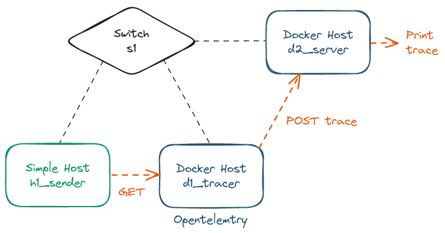

# <span style="color: #ff5733;"> Observability </span> 


## <span style="color: #33ff57;"> Containernet </span> 

First of all, we wanted to create a complete network architecture. We started Mininet but Docker is more convenient for Open Telemetry usage.
That why we used Containernet ([github](https://github.com/containernet/containernet)) which is a Mininet based project allowing Docker as Host.

This section was used to create a simple example of Containernet, see below:


### <span style="color: #5733ff;"> Run a example </span> 

**<span style="color: #ff5733;">Prerequisites</span>**

<ul style="color: #ff5733;">
    <li>Docker installed</li>
    <li>Python3 installed</li>
    <li>Containernet installed</li>
</ul>

> To install Containernet you have to follow [this official Github](https://github.com/containernet/containernet). Pay attention, bare metal installation requires Ubuntu 18.04!

You can run this example using the `build.sh` file inside the `containernet` folder: `sudo ./build.sh`.
> Please don't use any prefix like `sudo ./containernet/build.sh`

### <span style="color: #5733ff;"> What it does ? </span> 

When you run the `build.sh`, it first build the two Docker ([Dockerfile.pinger](./containernet/Dockerfile.pinger) and [Dockerfile.receiver](./containernet/Dockerfile.receiver)) which are just updated Containernet examples adding specific Python scripts ([pinger.py](./containernet/pinger.py) and [receiver.py](./containernet/receiver.py)).

> pinger.py : ping the IP `10.0.0.252` corresponding to `d2` (Docker 2)

> receiver.py : print when it is pinged by someone

Then, it runs the [containernet_example.py](./containernet/containernet_example.py) using `python3 containernet_example.py`.
This one creates a Mininet architecture with :
* two basic hosts (h1 and h2), 
* two dockers hosts (d1 and d2), 
* all linked by a switch (s1)

Finally, the example processes a Connectivity test between each couple of host. It shows that Dockers can ping Dockers, Hosts can ping Hosts and they can ping them together!


## <span style="color: #33ff57;"> Open Telemetry </span> 

The `opentelemetry` folder include the POC of the opentelemetry activities.

**What is Opentelemetry?**
Opentelemetry is a open source software use to capture trace, logs and metrics from applications.

In this project context, we use it as a control tower which can stock all information from application.

**What we modelised?**
Using containernet we created this example erchitecture : 
* `sender`: a simple host which is used to ping a python server (`server`) with a GET request,
* `server`: this one is a python server containing  opentelemetry which intercept the GET from the sender, transform it to "trace" and then forward (POST) them to the "controller" (`tracer`),
* `tracer`: just a python server used to intercer "traces" and print them on the terminal.



**How to run this example?**

1. Run `sudo build.sh` from the `/opentelemetry` folder.
2. On the containernet CLI run:
```
containernet> xterm d1_tracer && xterm d2_server && xterm h1_sender
```
> It will create a terminal for each hosts.
3. From each of them do:
``` 
d1_tracer$ python3 tracer.py
```
``` 
d2_server$ python3 servWeb.py
```
``` 
h1_sender$ python3 sender/servAsk.py
```

> Now you can see the `h1_sender` sends GET requests to `d2_server` creating trace and forwarding them to `d1_tracer` who print them.


## <span style="color: #33ff57;"> A complete example of observability </span> 
