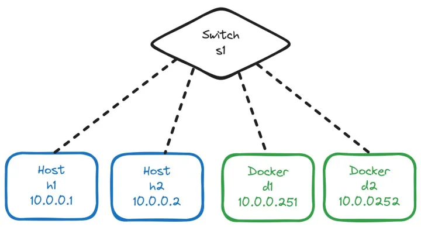
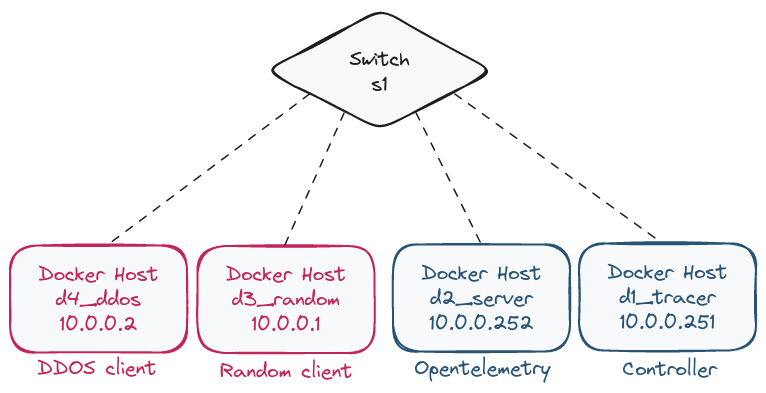
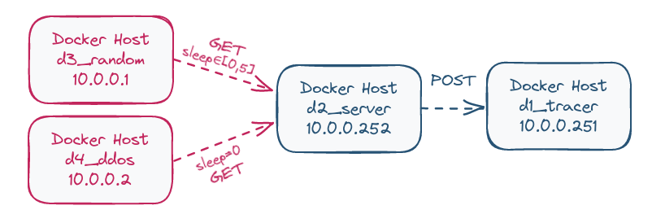

# <span style="color: #ff5733;"> Observability </span> 

Edited by: 
* [@EdgeOfMemory](https://github.com/EdgeOfMemory-cloud)
* [@Spraduss](https://github.com/Spraduss)
* [@FenrirWolf4566](https://github.com/FenrirWolf4566)


## <span style="color: #33ff57;"> Containernet: virtual network with docker </span> 

This section aimed to create a complete virtual network architecture. We started with standard Mininet hosts but Docker was more convenient for OpenTelemetry usage.
Therefore we used [Containernet](https://github.com/containernet/containernet) which is a Mininet based project allowing Docker as Host.

The picture below represents a simple example of Containernet:



### <span style="color: #5733ff;"> Run an example </span> 

**<span style="color: #ff5733;">Prerequisites</span>**

<ul style="color: #ff5733;">
    <li>Docker installed</li>
    <li>Python3 installed</li>
    <li>Containernet installed</li>
</ul>

> To install Containernet you have to follow [this official Github](https://github.com/containernet/containernet). Pay attention, bare metal installation requires Ubuntu 18.04!

You can run this example using the `build.sh` file inside the [containernet](./containernet/) folder: `sudo ./build.sh`.
> Please don't use any prefix like `sudo ./containernet/build.sh`

### <span style="color: #5733ff;"> What does it do? </span> 

When you run the `build.sh`, it first builds the two Docker images ([Dockerfile.pinger](./containernet/Dockerfile.pinger) and [Dockerfile.receiver](./containernet/Dockerfile.receiver)), which are just updated Containernet examples, adding specific Python scripts ([pinger.py](./containernet/pinger.py) and [receiver.py](./containernet/receiver.py)).

> pinger.py : pings the IP `10.0.0.252` corresponding to `d2` (Docker 2)

> receiver.py : prints when it is pinged by someone

Then, it runs the [containernet_example.py](./containernet/containernet_example.py) file using `python3 containernet_example.py`.
This one creates a Mininet architecture with :
* two basic hosts (h1 and h2), 
* two dockers hosts (d1 and d2), 
* all linked by a switch (s1)

Finally, the example processes a connectivity test between each couple of host. It shows that Dockers can ping Dockers, Hosts can ping Hosts and they can ping them together!

## <span style="color: #33ff57;"> OpenTelemetry </span> 

The [opentelemetry](./opentelemetry/) folder includes the proof of concept of the opentelemetry activities.

**What is OpenTelemetry?**
Opentelemetry is an open source software uses to capture traces, logs and metrics from applications.

In this project context, we use it as a control tower which can stock all information from application.

**What does this model?**
Using Containernet we created this architecture example: 
* `client_random`: a docker host used to constantly send `GET` requests to the python server with a random time (between 0 and 4 seconds),
* `client_ddos`: another docker host which send `GET` requests to the same python server but without cooldown (really simple DDOS simulation),
* `server`: docker host running a python server containing  opentelemetry, its role is to intercept GET requests from clients, transform them to "trace" and then forward (POST) them to the "controller" (`tracer`),
* `tracer`: docker host with another python server used to intercer "traces" and register them in a csv file.




**How to run this example?**

1. Run `sudo build.sh` from the `/opentelemetry` folder.
2. On the containernet CLI run:
```
containernet> xterm d1_tracer && xterm d2_server && xterm d3_random && xterm d4_ddos
```
> It will create a terminal for each hosts.
3. From each of them do:
``` 
d1_tracer$ python3 tracer.py
```
``` 
d2_server$ python3 server.py
```
``` 
d3_random$ python3 client_random.py
```
``` 
d4_ddos$ python3 client_ddos.py
```



When a trace is received by d1_tracer, it is registered in a CSV file corresponding to the IP address of the client (in our example: 10_0_0_1.csv for d3_random and 10_0_0_2.csv for d4_ddos).

Each line of the CSV file contains a different span with the following information:
* Span name.
* Elapsed time of the span (corresponding to the time taken by the request).
* Set of events (description followed by the timestamp).
* Set of attributes (name followed by a value).

## <span style="color: #33ff57;"> Observability </span> 

The example provided is more similar to supervision.

Observability refers to the capacity to transmit and interpret information across a network and subsequently issue alerts based on instructions. The last point has not yet been addressed.

However, the recovered traces can be stored and processed using either raw processing or artificial intelligence.